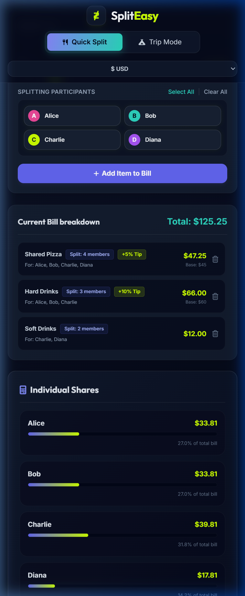
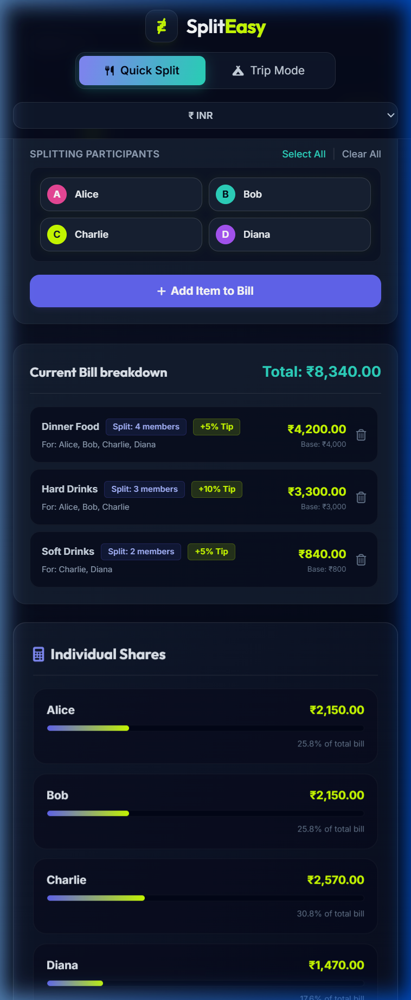
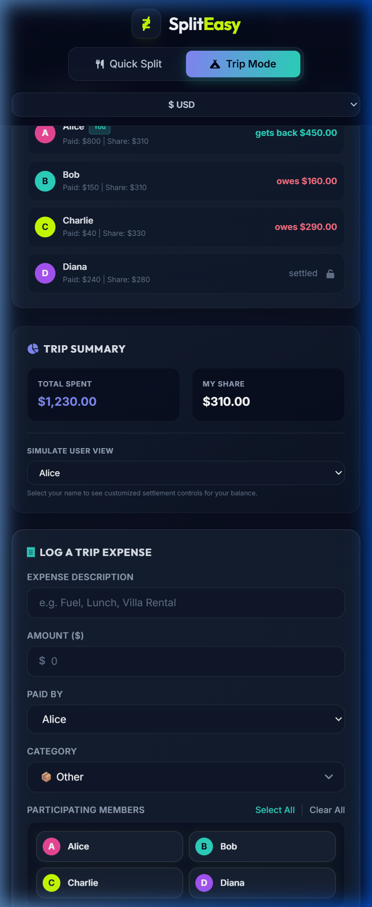
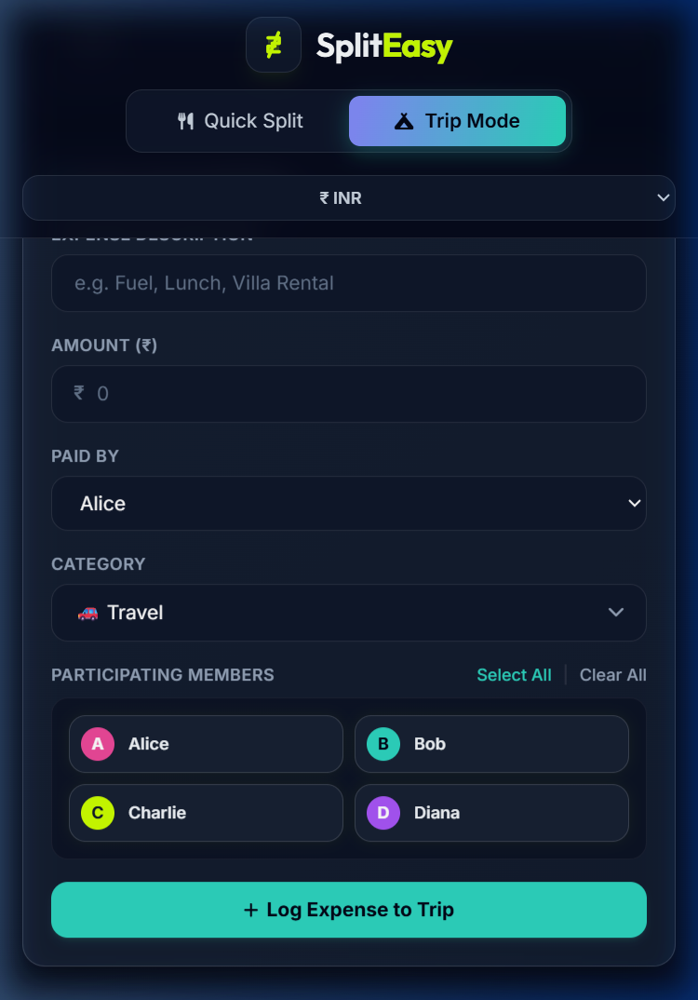

# 🧾 SplitEasy — Smart & Collaborative Expense Splitter

> **Split bills instantly. No app. No login. Just share a link.**

SplitEasy is a zero-friction, mobile-first expense splitter built for real people — friends at dinner, families on vacation, colleagues at team outings. Two powerful modes, one beautiful interface.

---

## ✨ Two Modes, One Tool

| Mode | Best For | Requires Backend? |
|---|---|---|
| 🍽️ **Quick Split** | Restaurant bills, groceries, one-time events | ❌ No — 100% offline |
| 🏕️ **Trip / Outing** | Multi-day trips, group travel, outings | ✅ Yes — Supabase real-time sync |

---

## 📱 App Screenshots

<div align="center">

### Quick Split — USD


*Split restaurant bills across multiple categories — Food, Drinks, Desserts — where each person picks only what they had.*

---

### Quick Split — INR


*Works natively in ₹ Indian Rupees — perfect for splitting the Saturday night dinner with your squad.*

---

### Trip Mode — USD (Settlement View)


*Live shared ledger — expenses from every member appear in real time. Settlement suggestions minimize the number of payments.*

---

### Trip Mode — INR


*On a Goa trip? Himachal trek? Create a session, share the link on WhatsApp, and everyone is in — instantly.*

</div>

---

## 🏕️ Why Trip Mode is a Game-Changer

> *No app download. No sign-up. No credit card. Just a link.*

### ⚡ Zero Friction for Everyone

Most expense apps fail because half the group won't install them. **SplitEasy works entirely in the browser.**

- 🔗 **One link is all it takes** — paste it in your WhatsApp group, Telegram chat, or group DM.
- 📲 **They tap the link, enter their name, and they're in** — nothing to install, nothing to create an account for.
- 🌐 **Works on every phone** — Android, iPhone, any browser, any OS.

Your Delhi friends, your Pune cousins, your tech-averse uncle — everyone joins the same trip in seconds.

---

### 👥 A Shared Ledger, Visible to All

Once inside the trip session, **every expense added by any member is instantly visible to everyone else** — in real time, thanks to live database sync.

- Add "Hotel: ₹4,500" and your roommate sees it immediately.
- Mark "Fuel: ₹2,100 split by Raj, Priya, Ankit" and the breakdown updates live.
- No more "wait, who paid for breakfast?" moments.

The entire group stays on the same page — literally.

---

### 🔒 Trust-Protected: Your Expenses Are Safe

This is not a free-for-all. **SplitEasy enforces a strict trust model:**

- ✅ **You can only edit or delete your own expenses.**
- 🚫 **No one can remove another person's expense or rename someone else.**
- 🛡️ **Participant identities are locked** — once you join under your name, that identity is bound to your device.

This prevents accidental (or intentional) tampering. Everyone's contributions are protected.

---

### 👑 The Owner is Always in Control

When you create a trip, you become the **Trip Owner**. You have full control over the session:

- **Add participants by name** — you curate who is officially on the trip.
- **If someone tries to join under an unauthorized name**, you can:
  - 🔄 **Reset the invite link** — the old link becomes invalid instantly.
  - ❌ **Remove the participant** from the trip entirely.
- **The session lives as long as you want it to** — active for days, weeks, even months until you close it.

No one can crash your trip. The owner's word is final.

---

### 📅 Session Flexibility

- **Create a new trip anytime** — just click the "Trip Plan" tab, start a new session, and share the fresh link.
- **One group, one link** — the link is the trip. No codes to memorize, no ID to share separately.
- **Long-running sessions** — perfect for month-long road trips, office events planned over time, or recurring flatmate expense tracking.

---

### 💸 Settlement Made Simple

At any point during or after the trip, tap **Settle Up** to see the optimized payment plan:

- The greedy algorithm **minimizes the number of payments** — instead of 6 people paying each other 15 different amounts, it suggests 3–4 direct transfers.
- **UPI payment flow** built in — debtors tap Pay, see the QR/UPI details, confirm payment. Creditors get a notification and confirm receipt.
- Outstanding payments are clearly marked: **Pending** / **Awaiting Confirmation** / **Settled**.

---

## 🍽️ Quick Split — When You Don't Need a Session

Perfect for when you're at a restaurant and want to split right now:

1. Add the participants (up to 10 people)
2. Add expense categories: **Food**, **Drinks**, **Desserts**, etc.
3. Check who participated in each category
4. SplitEasy instantly shows **exactly how much each person owes**

No data saved, no backend, no setup. Close the tab when you're done.

---

## 🛠️ Technical Architecture

| Layer | Technology |
|---|---|
| Frontend | Vanilla HTML5, CSS3, ES6+ JavaScript |
| Styling | Tailwind CSS (CDN) + Custom CSS |
| Database | Supabase (PostgreSQL + Real-time WebSockets) |
| Sync | Supabase Realtime Subscriptions |
| Settlement | Greedy Debt Minimization Algorithm |

---

## ⚙️ Supabase Database Setup

To enable **Trip Mode**, run the following SQL in your Supabase SQL Editor:

```sql
-- 1. Trips table
create table trips (
  id text primary key,
  name text not null,
  created_at timestamptz default now(),
  expires_at timestamptz default (now() + interval '7 days'),
  host_name text not null
);

-- 2. Members table
create table members (
  id uuid primary key default gen_random_uuid(),
  trip_id text references trips(id) on delete cascade,
  name text not null,
  device_id text default null,
  joined_at timestamptz default now()
);

-- 3. Expenses table
create table expenses (
  id uuid primary key default gen_random_uuid(),
  trip_id text references trips(id) on delete cascade,
  member_id uuid references members(id) on delete cascade,
  member_name text not null,
  category text not null,
  amount numeric not null,
  note text,
  created_at timestamptz default now()
);

-- 4. Disable RLS for easy frontend querying
alter table trips disable row level security;
alter table members disable row level security;
alter table expenses disable row level security;

-- 5. Enable Real-Time on members and expenses
alter publication supabase_realtime add table expenses;
alter publication supabase_realtime add table members;

-- NOTE: If tables already exist, add the device_id column:
-- ALTER TABLE members ADD COLUMN device_id text default null;
```

---

## 🚀 Getting Started

1. **Clone / download** `index.html`, `style.css`, `app.js`
2. **Open** `index.html` in any browser — or run with `python -m http.server 8000`
3. **Configure Supabase** (for Trip Mode):
   - Click the ⚙️ settings icon in the header
   - Enter your **Supabase URL** and **Anon Key** (from *Project Settings → API*)
   - Credentials are saved in `localStorage`
4. **Quick Split**: No config needed — add names, add items, split instantly.
5. **Trip Mode**:
   - Click "Create Session", enter trip name and your name
   - Share the generated link (e.g. `spliteasy.in/#TRIP-XYZ12`) on WhatsApp
   - Friends tap the link, enter their name, and start adding expenses

---

## 📋 Feature Highlights

| Feature | Description |
|---|---|
| Custom Categories | Split Food, Drinks, Accommodation separately with per-category participants |
| Real-Time Sync | All members see new expenses the moment they're added |
| Greedy Settlement | Minimum number of peer-to-peer payments to clear all debts |
| UPI Payment Flow | Debtors initiate, creditors confirm — full receipt audit trail |
| Trust Protection | You can only edit your own expenses |
| Owner Controls | Reset invite link, remove rogue participants |
| Multi-Currency | USD 🇺🇸, INR 🇮🇳, EUR 🇪🇺, GBP 🇬🇧 and more |
| Zero Install | 100% browser-based — no app, no sign-up required |

---

*Built with ❤️ for travelers, foodies, and anyone who's ever said "we'll sort out the money later".*
